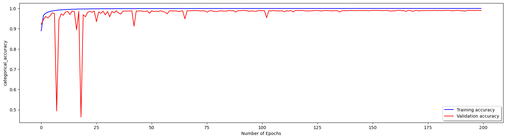
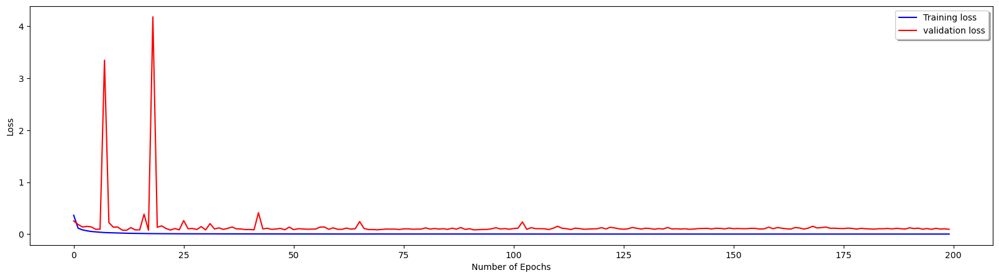
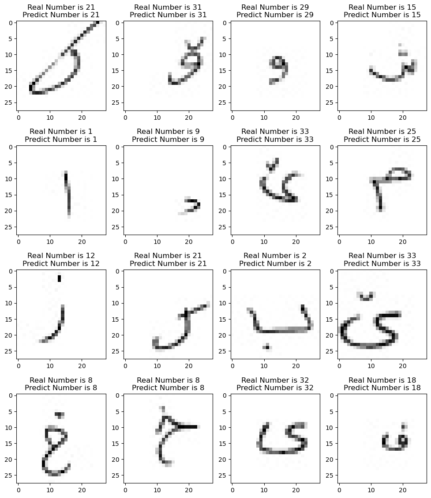
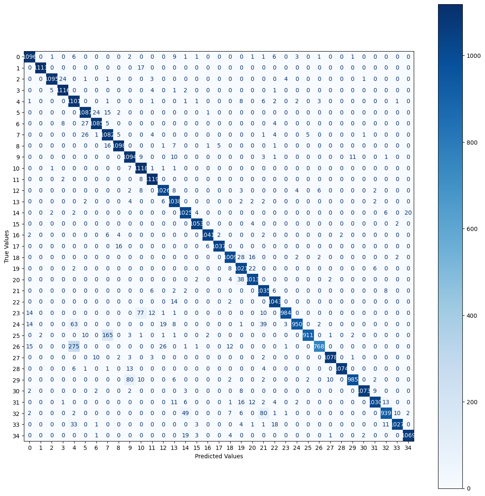

## Link of the trained model

* link of the jupyter notebook [here](https://colab.research.google.com/drive/1ERrls_fPQgZfdjcFMa83J7JYnu9_TBjD?usp=sharing)

## Training and validation accuracy and loss

## Example of prediction of character

## Confusion Matrix For character

## Evaluation and Training accuracies For character

* Evaluation Accuracy: 0.9953

* Training Accuracy: 0.9997

## Accuracy, Precision, Recall, F1 Score for all class For character

|   Overall   | Accuracy | Precision |  Recall  | F1 Score |
|-------------|----------|-----------|----------|----------|
|    All      |  0.9491  |   0.9533  |  0.9491  |  0.9491  |

## Accuracy, Precision, Recall, F1 Score for different class For character

|        Class | True Samples | Classified Samples | Accuracy   | Precision  | Recall     | F1 Score   |
|-------------:|-------------:|-------------------:|------------|------------|------------|------------|
|            0 |         1129 |               1146 | 97.0771%   | 95.637%    | 97.0771%   | 96.3516%   |
|            1 |         1128 |               1113 | 98.4929%   | 99.8203%   | 98.4929%   | 99.1522%   |
|            2 |         1129 |               1104 | 96.9885%   | 99.1848%   | 96.9885%   | 98.0743%   |
|            3 |         1129 |               1151 | 98.8485%   | 96.9592%   | 98.8485%   | 97.8947%   |
|            4 |         1128 |               1490 | 97.6064%   | 73.8926%   | 97.6064%   | 84.1100%   |
|            5 |         1129 |               1154 | 96.2799%   | 94.1941%   | 96.2799%   | 95.2256%   |
|            6 |         1129 |               1124 | 96.1027%   | 96.5302%   | 96.1027%   | 96.3160%   |
|            7 |         1129 |               1292 | 95.8370%   | 83.7461%   | 95.8370%   | 89.3845%   |
|            8 |         1129 |               1127 | 97.2542%   | 97.4268%   | 97.2542%   | 97.3404%   |
|            9 |         1129 |               1210 | 96.8999%   | 90.4132%   | 96.8999%   | 93.5442%   |
|           10 |         1129 |               1248 | 99.0257%   | 89.5833%   | 99.0257%   | 94.0682%   |
|           11 |         1129 |               1153 | 99.1143%   | 97.0512%   | 99.1143%   | 98.0719%   |
|           12 |         1059 |               1081 | 96.8839%   | 94.9121%   | 96.8839%   | 95.8879%   |
|           13 |         1058 |               1117 | 98.1096%   | 92.9275%   | 98.1096%   | 95.4483%   |
|           14 |         1059 |               1109 | 96.7894%   | 92.4256%   | 96.7894%   | 94.5572%   |
| 15    | 1059         | 1068               | 99.43%      | 98.60%      | 99.43%      | 99.01%      |
| 16    | 1059         | 1051               | 98.30%      | 99.05%      | 98.30%      | 98.67%      |
| 17    | 1059         | 1044               | 97.92%      | 99.33%      | 97.92%      | 98.62%      |
| 18    | 1059         | 1049               | 95.28%      | 96.19%      | 95.28%      | 95.73%      |
| 19    | 1059         | 1135               | 96.41%      | 89.96%      | 96.41%      | 93.07%      |
| 20    | 1059         | 1071               | 95.66%      | 94.58%      | 95.66%      | 95.12%      |
| 21    | 1059         | 1190               | 97.73%      | 86.97%      | 97.73%      | 92.04%      |
| 22    | 1059         | 1091               | 98.49%      | 95.60%      | 98.49%      | 97.02%      |
| 23    | 1099         | 993                | 89.54%      | 99.09%      | 89.54%      | 94.07%      |
| 24    | 1099         | 963                | 86.44%      | 98.65%      | 86.44%      | 92.14%      |
| 25    | 1099         | 918                | 82.89%      | 99.24%      | 82.89%      | 90.33%      |
| 26    | 1099         | 782                | 69.88%      | 98.21%      | 69.88%      | 81.66%      |
| 27    | 1099         | 1092               | 98.09%      | 98.72%      | 98.09%      | 98.40%      |
| 28    | 1099         | 1076               | 97.73%      | 99.81%      | 97.73%      | 98.76%      |
| 29    | 1099         | 1000               | 89.63%      | 98.50%      | 89.63%      | 93.85%      |
| 30    | 1099         | 1077               | 97.63%      | 99.63%      | 97.63%      | 98.62%      |
| 31    | 1098         | 1051               | 93.81%   | 98.00%    | 93.81% | 95.86%   |
| 32    | 1099         | 978                | 85.44%      | 96.01%      | 85.44%      | 90.42%      |
| 33    | 1099         | 1042               | 93.45%      | 98.56%      | 93.45%      | 95.94%      |
| 34    | 1099         | 1091               | 97.27%      | 97.98%      | 97.27%      | 97.63%      |

## Model Summery

|     Layer (type)         | Output Shape |    Param #    |
|--------------------------|--------------|---------------|
|     conv2d               | (None, 26, 26, 64) | 640   |
|     activation           | (None, 26, 26, 64) | 0     |
|     max_pooling2d        | (None, 25, 25, 64) | 0     |
|     batch_normalization  | (None, 25, 25, 64) | 256   |
|     conv2d_1             | (None, 23, 23, 128) | 73856 |
|     activation_1         | (None, 23, 23, 128) | 0     |
|     max_pooling2d_1      | (None, 22, 22, 128) | 0     |
|     batch_normalization_1| (None, 22, 22, 128) | 512   |
|     conv2d_2             | (None, 22, 22, 192) | 24768 |
|     activation_2         | (None, 22, 22, 192) | 0     |
|     batch_normalization_2| (None, 22, 22, 192) | 768   |
|     conv2d_3             | (None, 20, 20, 192) | 331968|
|     activation_3         | (None, 20, 20, 192) | 0     |
|     batch_normalization_3| (None, 20, 20, 192) | 768   |
|     conv2d_4             | (None, 18, 18, 128) | 221312|
|     activation_4         | (None, 18, 18, 128) | 0     |
|     max_pooling2d_2      | (None, 17, 17, 128) | 0     |
|     batch_normalization_4| (None, 17, 17, 128) | 512   |
|     flatten              | (None, 36992)       | 0     |
|     dense                | (None, 2048)        | 75761664|
|     activation_5         | (None, 2048)        | 0     |
|     dropout              | (None, 2048)        | 0     |
|     batch_normalization_5| (None, 2048)        | 8192  |
|     dense_1              | (None, 2048)        | 4196352|
|     activation_6         | (None, 2048)        | 0     |
|     dropout_1            | (None, 2048)        | 0     |
|     batch_normalization_6| (None, 2048)        | 8192  |
|     dense_2              | (None, 800)         | 1639200|
|     activation_7         | (None, 800)         | 0     |
|     dropout_2            | (None, 800)         | 0     |
|     batch_normalization_7| (None, 800)         | 3200  |
|     dense_3              | (None, 35)          | 28035 |
|     activation_8         | (None, 35)          | 0     |
|             |      |   |
|             |      |   |
|             |      |   |
|     **Total params**      | **82,300,195**|
|     **Trainable params**      | **82,288,995**|
| **Non-trainable params** |   **11,200**  |

