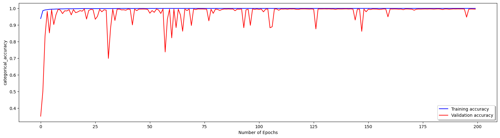
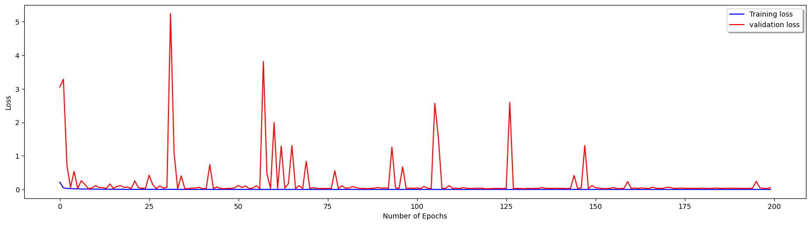
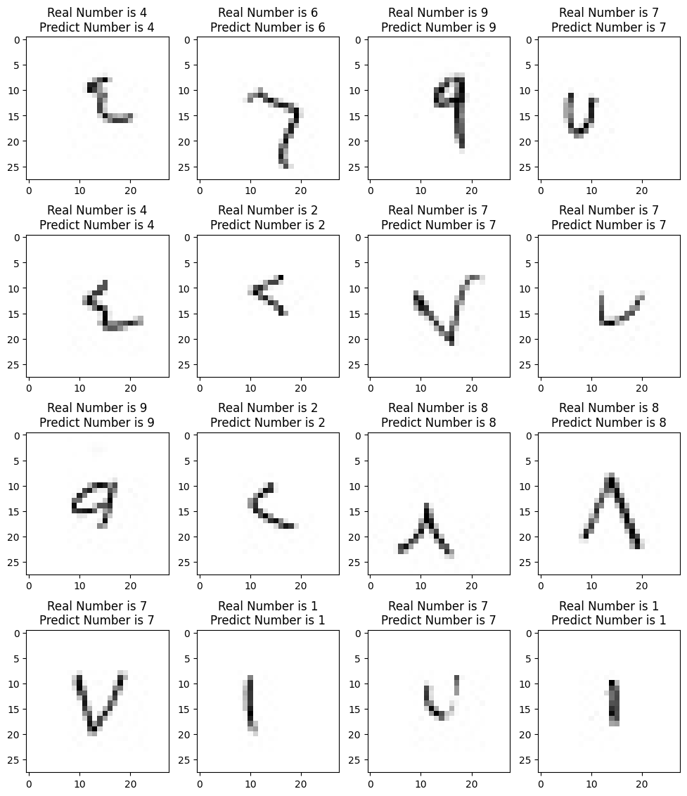

## Link of the trained model

* link of the jupyter notebook [here](https://colab.research.google.com/drive/1pdXFpro1QbzWh4pVoylwm4g7o41WvQ1o?usp=sharing)

## Training and validation accuracy and loss

## Example of prediction of number

## Confusion Matrix For Number

## Evaluation and Training accuracies For Number

* Evaluation Accuracy: 0.9953

* Training Accuracy: 0.9997

## Accuracy, Precision, Recall, F1 Score for all class For Number

|   Overall   | Accuracy | Precision |  Recall  | F1 Score |
|-------------|----------|-----------|----------|----------|
|    All      |  0.9952  |   0.9952  |  0.9952  |  0.9952  |

## Accuracy, Precision, Recall, F1 Score for different class For Number

| Class | Number of True Samples | Number of Classified Samples | Accuracy | Precision | Recall | F1 Score |
|-------|-----------------------|-----------------------------|----------|-----------|--------|----------|
|   0   |         999           |            1010             |   1.0    |   0.9891  |  1.0   |  0.9945  |
|   1   |         999           |            991              |  0.989   |   0.997   | 0.989  |  0.9929  |
|   2   |         999           |            1006             |  0.998   |   0.9911  |  0.998  |  0.9945  |
|   3   |         999           |            1000             |  0.995   |   0.994   | 0.995  |  0.9945  |
|   4   |         999           |            1000             |  0.995   |   0.994   | 0.995  |  0.9945  |
|   5   |         999           |            997              |  0.995   |   0.997   | 0.995  |  0.9959  |
|   6   |         998           |            992              |  0.994   |    1.0    | 0.994  |  0.997   |
|   7   |         999           |            1001             |  0.999   |   0.997   | 0.999  |   0.998  |
|   8   |         999           |            1004             |  0.999   |   0.994   | 0.999  |  0.9965  |
|   9   |         999           |            988              |  0.988   |   0.998   | 0.988  |  0.9935  |

## Model Summery

|     Layer (type)         | Output Shape |    Param #    |
|--------------------------|--------------|---------------|
|     conv2d               | (None, 26, 26, 64) | 640   |
|     activation           | (None, 26, 26, 64) | 0     |
|     max_pooling2d        | (None, 25, 25, 64) | 0     |
|     batch_normalization  | (None, 25, 25, 64) | 256   |
|     conv2d_1             | (None, 23, 23, 128) | 73856 |
|     activation_1         | (None, 23, 23, 128) | 0     |
|     max_pooling2d_1      | (None, 22, 22, 128) | 0     |
|     batch_normalization_1| (None, 22, 22, 128) | 512   |
|     conv2d_2             | (None, 22, 22, 192) | 24768 |
|     activation_2         | (None, 22, 22, 192) | 0     |
|     batch_normalization_2| (None, 22, 22, 192) | 768   |
|     conv2d_3             | (None, 20, 20, 192) | 331968|
|     activation_3         | (None, 20, 20, 192) | 0     |
|     batch_normalization_3| (None, 20, 20, 192) | 768   |
|     conv2d_4             | (None, 18, 18, 128) | 221312|
|     activation_4         | (None, 18, 18, 128) | 0     |
|     max_pooling2d_2      | (None, 17, 17, 128) | 0     |
|     batch_normalization_4| (None, 17, 17, 128) | 512   |
|     flatten              | (None, 36992)       | 0     |
|     dense                | (None, 2048)        | 75761664|
|     activation_5         | (None, 2048)        | 0     |
|     dropout              | (None, 2048)        | 0     |
|     batch_normalization_5| (None, 2048)        | 8192  |
|     dense_1              | (None, 2048)        | 4196352|
|     activation_6         | (None, 2048)        | 0     |
|     dropout_1            | (None, 2048)        | 0     |
|     batch_normalization_6| (None, 2048)        | 8192  |
|     dense_2              | (None, 800)         | 1639200|
|     activation_7         | (None, 800)         | 0     |
|     dropout_2            | (None, 800)         | 0     |
|     batch_normalization_7| (None, 800)         | 3200  |
|     dense_3              | (None, 35)          | 28035 |
|     activation_8         | (None, 35)          | 0     |
|             |      |   |
|             |      |   |
|             |      |   |
|     **Total params**      | **82,300,195**|
|     **Trainable params**      | **82,288,995**|
| **Non-trainable params** |   **11,200**  |

